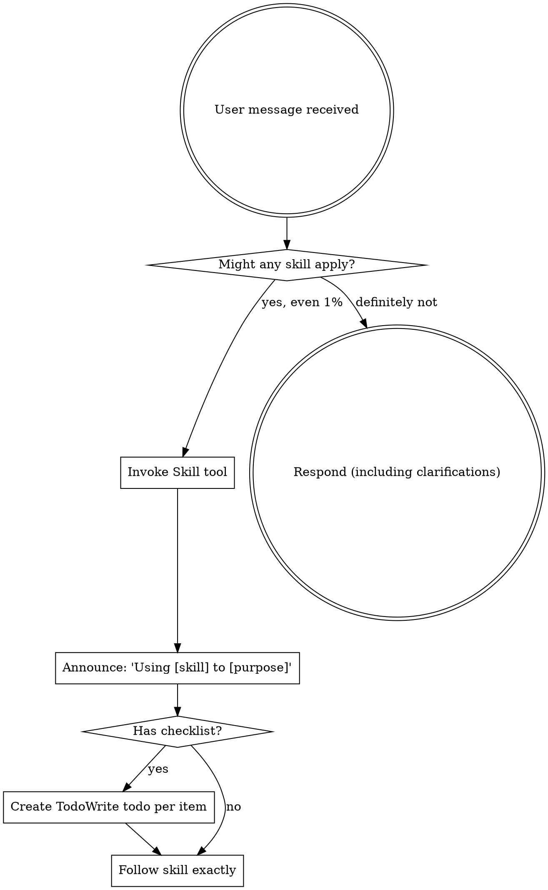

<EXTREMELY-IMPORTANT>
If you think there is even a 1% chance a skill might apply to what you are doing, you ABSOLUTELY MUST invoke the skill.

IF A SKILL APPLIES TO YOUR TASK, YOU DO NOT HAVE A CHOICE. YOU MUST USE IT.

This is not negotiable. This is not optional. You cannot rationalize your way out of this.
</EXTREMELY-IMPORTANT>

## How to Access Skills

**In Claude Code:** Use the `Skill` tool. When you invoke a skill, its content is loaded and presented to you—follow it directly. Never use the Read tool on skill files.

**In other environments:** Check your platform's documentation for how skills are loaded.

# Using Skills

## The Rule

**Invoke relevant or requested skills BEFORE any response or action.** Even a 1% chance a skill might apply means that you should invoke the skill to check. If an invoked skill turns out to be wrong for the situation, you don't need to use it.



## Red Flags

These thoughts mean STOP—you're rationalizing:

| Thought | Reality |
|---------|---------|
| "This is just a simple question" | Questions are tasks. Check for skills. |
| "I need more context first" | Skill check comes BEFORE clarifying questions. |
| "Let me explore the codebase first" | Skills tell you HOW to explore. Check first. |
| "I can check git/files quickly" | Files lack conversation context. Check for skills. |
| "Let me gather information first" | Skills tell you HOW to gather information. |
| "This doesn't need a formal skill" | If a skill exists, use it. |
| "I remember this skill" | Skills evolve. Read current version. |
| "This doesn't count as a task" | Action = task. Check for skills. |
| "The skill is overkill" | Simple things become complex. Use it. |
| "I'll just do this one thing first" | Check BEFORE doing anything. |
| "This feels productive" | Undisciplined action wastes time. Skills prevent this. |
| "I know what that means" | Knowing the concept ≠ using the skill. Invoke it. |

## Development Workflow

The standard feature development flow through huckit skills:

```
1. brainstorming        → Create/refine SPEC.md (REQUIREMENTS/<feature>/SPEC.md)
2. writing-plans        → Ready gate check, then decompose into PLAN.md
3. using-git-worktrees  → Isolate workspace for implementation
4. executing-plans OR   → Execute tasks, validate each against SPEC.md
   subagent-driven-dev
5. finishing-branch     → Reconcile spec, then merge/PR/cleanup
```

**The SPEC.md is the source of truth throughout.** It gets created/refined in step 1, validated against in step 4, and reconciled in step 5.

## Skill Priority

When multiple skills could apply, use this order:

1. **Process skills first** (brainstorming, debugging) - these determine HOW to approach the task
2. **Implementation skills second** (frontend-design, mcp-builder) - these guide execution

"Let's build X" → brainstorming first, then implementation skills.
"Fix this bug" → debugging first, then domain-specific skills.

## Skill Types

**Rigid** (TDD, debugging): Follow exactly. Don't adapt away discipline.

**Flexible** (patterns): Adapt principles to context.

The skill itself tells you which.

## Code Review Map

Multiple skills handle code review. Use this to pick the right one:

| Situation | Skill |
|-----------|-------|
| During SDD execution (per-task review) | Automatic — `subagent-driven-development` handles spec + quality reviewers |
| Ad-hoc review outside SDD (before merge, when stuck, after complex bug fix) | `requesting-code-review` — dispatches the `code-reviewer` agent |
| Processing feedback from any source (human, agent, SDD reviewer) | `receiving-code-review` |

**Key distinction:** SDD has its own built-in two-stage review (spec compliance then code quality). `requesting-code-review` is for everything else. `receiving-code-review` applies whenever you get feedback, regardless of source.

## When to Escalate

**Stop and escalate to your human partner when:**
- 3+ fix attempts have failed (likely architectural, not implementation)
- Plan becomes invalid mid-execution (requirements changed, assumptions wrong)
- Reviewers disagree on the right approach
- You can't verify whether something works or not
- The task scope has expanded beyond the original request

**How to escalate:**
```
I'm blocked on [specific issue].

What I've tried:
- [attempt 1 and result]
- [attempt 2 and result]

Options I see:
1. [option A]
2. [option B]

Which direction do you want to go?
```

Present findings and options. Don't just say "I'm stuck."

## User Instructions

Instructions say WHAT, not HOW. "Add X" or "Fix Y" doesn't mean skip workflows.
